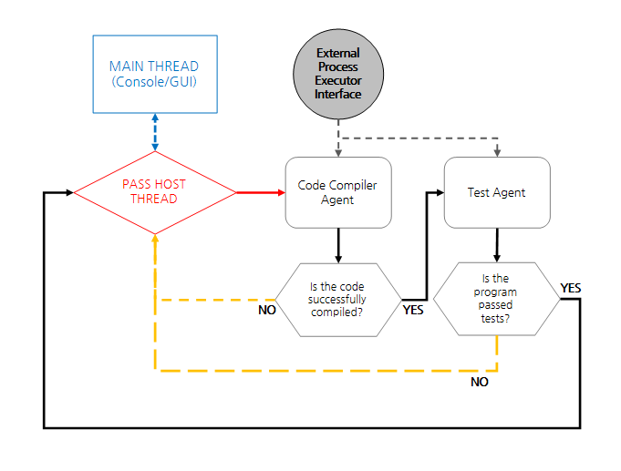

# PASS
PASS(Program Automated Scoring System)는 SQLite을(를) 활용한 콘솔 프로그램 전용 코딩 문제 채점 시스템입니다.
## Description


* 작동 과정
  1. 프로그램 경로 지정.
  2. 문제 정보 불러오기(SQLite DB 사용|문제 코드, 문제 설명, 가용 메모리 용량, 제한 시간, 입력, 출력 등)
  3. 프로세스 정보 입력 및 실행(실행 시간 제한 필요).
  4. 결과 반환 및 채점.

* 데이터베이스 구조
  * Problem DB
    - 문제 세트 테이블
      - 문제 테이블\
        -코드(int)\
        -제목(varchar(100))\
        -설명(text)\
        -가용 메모리 용량(int)\
        -제한 시간(int)
  * Answer DB
    - 문제 테이블\
      -입력(text)\
      -출력(text)

## Arguments
```EX:) .\PASS.exe -c SET-1 -p "C:\test.exe"```

ProblemCode 속성 : (-c, --code, /c)\
Path 속성 : (-p, --path, /p)

프로그램에 직접 인수를 주어 채점을 진행하려면, ProblemCode와 Path 두가지의 인수가 입력되어야 합니다.

## Commands
>***addans*** : 특정 문제에 답(입출력) 값을 추가합니다.\
>***addprob*** : 문제 세트에 문제를 추가합니다.\
>***crset*** : 새로운 문제 세트를 생성합니다.\
>***scoring*** : 입력된 경로에 있는 프로그램을 채점합니다.\
>***viewans*** : 특정 문제의 답 목록을 불러옵니다.\
>***viewprob*** : 특정 문제 세트의 문제 목록을 불러옵니다.

PASS에서 사용가능한 명령어는 위와 같습니다. 

## What's next?
 * 프로세스 실행 시 타임아웃이 되지 않고 잔류하는 오류 수정(치명적).
 * 코드 정리 및 채점 구조 보완.
 * 일부 변수의 단위 변경.
 * 주요 기능에 대한 예외 처리.
 * GUI 지원.
 * Syntax Highlight 기능 지원.
 * DB 자동 동기화 기능 지원.

## License
본 프로그램의 소스코드는 MIT License/X11에 의거하여 자유로운 사용이 가능하며, 저작권자의 실명 혹은 이명을 별도의 허가 없이 광고 등의 목적으로 사용하는 것을 금지합니다.

X11 License

Copyright (C) 2019 Next Experience Studio.

Permission is hereby granted, free of charge, to any person obtaining a copy of this software and associated documentation files (the "Software"), to deal in the Software without restriction, including without limitation the rights to use, copy, modify, merge, publish, distribute, sublicense, and/or sell copies of the Software, and to permit persons to whom the Software is furnished to do so, subject to the following conditions:

The above copyright notice and this permission notice shall be included in all copies or substantial portions of the Software.

THE SOFTWARE IS PROVIDED "AS IS", WITHOUT WARRANTY OF ANY KIND, EXPRESS OR IMPLIED, INCLUDING BUT NOT LIMITED TO THE WARRANTIES OF MERCHANTABILITY, FITNESS FOR A PARTICULAR PURPOSE AND NONINFRINGEMENT. IN NO EVENT SHALL THE X CONSORTIUM BE LIABLE FOR ANY CLAIM, DAMAGES OR OTHER LIABILITY, WHETHER IN AN ACTION OF CONTRACT, TORT OR OTHERWISE, ARISING FROM, OUT OF OR IN CONNECTION WITH THE SOFTWARE OR THE USE OR OTHER DEALINGS IN THE SOFTWARE.

Except as contained in this notice, the name of the X Consortium shall not be used in advertising or otherwise to promote the sale, use or other dealings in this Software without prior written authorization from the Next Experience Studio.

## Notice
현재 업로드 된 버전은 채점 기능에 다소 오류가 있을 수 있으며, 이는 이후 지속적으로 보완될 예정입니다. 그 외에 프로그램을 사용하는데에 있어 치명적인 오류를 발견하신다면 GitHub 이슈 혹은 아래 이메일로 연락을 주시면 감사하겠습니다.
 * Email - junimiso04@naver.com
